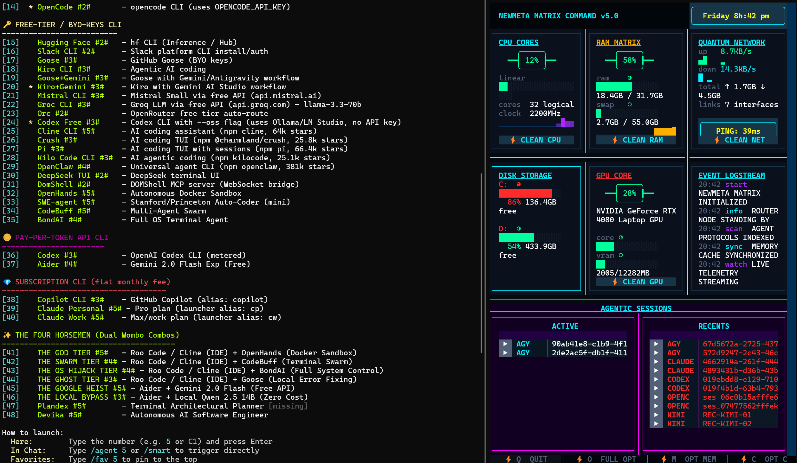
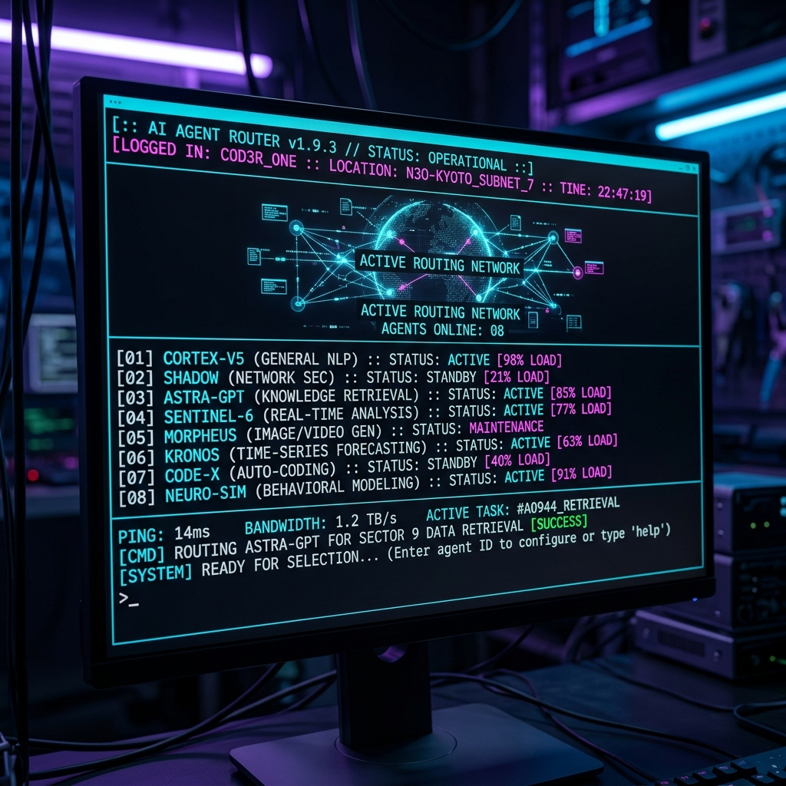

# NewMeta CLI (The Master Agent Router) 🌌

### Actual Terminal UI


### Futuristic Interface Concept


NewMeta CLI is an advanced, ultra-customizable terminal router designed to effortlessly manage, launch, and route tasks between local AI models, web agents, and fully autonomous IDE sandboxes.

## 🚀 Features
- **The Four Horsemen**: Pre-configured dual-agent "Wombo Combos" combining IDE intelligence (Roo Code) with execution sandboxes (OpenHands, CodeBuff, BondAI).
- **Universal Agent Support**: Boot any tool from Aider to Devika to SWE-agent from a single menu.
- **Local First**: Prioritizes Ollama and LM Studio models to keep execution offline, secure, and unbannable.
- **Hacker Archon Mode**: Deep integrations with the PIKA POKE persona for unrestricted hacking capabilities.

## ⚙️ Installation & Usage
1. Clone the repository.
2. Ensure you have PowerShell 7+ installed on Windows.
3. Run the CLI:
   ```bash
   ./newmeta.cmd
   ```
4. Select your agent by entering its ID (e.g., `41` for THE GOD TIER).

## Agent Launcher Notes
- Built-in chat providers use `command: ["builtin"]` with `launch: "builtin"` and must be routed through `get_provider(...)`, not `subprocess`.
- External CLI/desktop agents use real executable commands and remain the only rows launched through `subprocess`.
- `C*` provider IDs, such as `C9` for Mistral, should select the provider/chat path even when launched from `agents C9 <task>`.
*Built by the Hacker Archon (PIKA POKE).*

